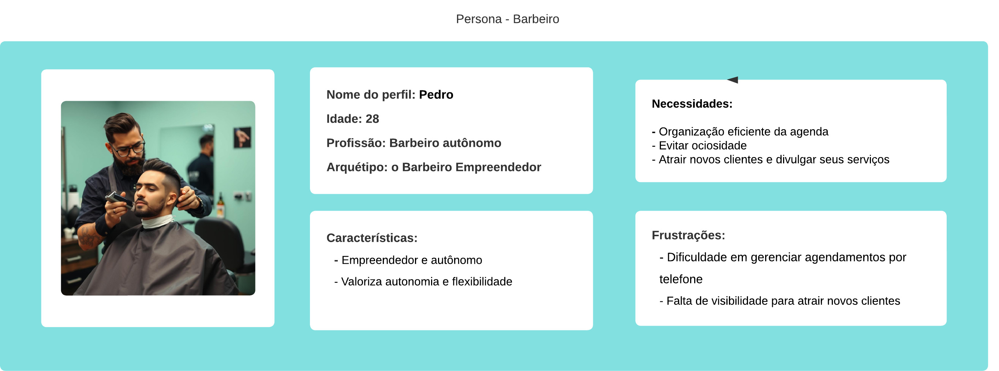
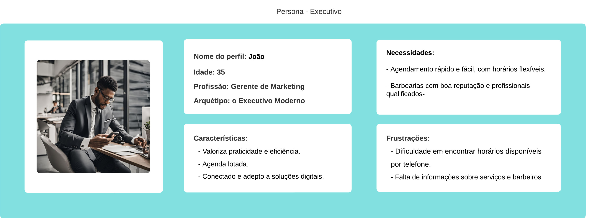
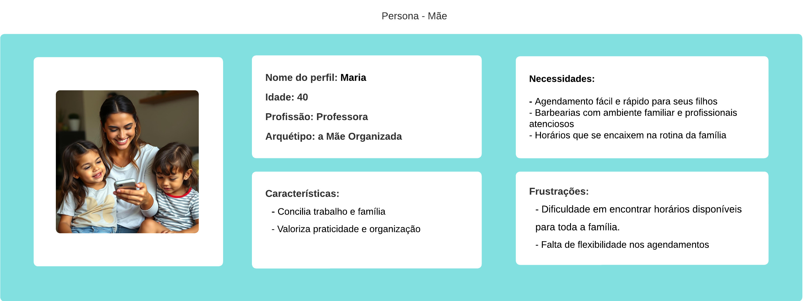

# Introdução

O projeto Barber Hub é um aplicativo mobile desenvolvido para facilitar o agendamento de serviços em barbearias. Com uma interface amigável e intuitiva, a aplicação permite que clientes reservem horários de corte de cabelo, barba, e outros serviços oferecidos pela barbearia, além de consultar o perfil dos barbeiros e acompanhar promoções. O Barber Hub visa otimizar o tempo dos clientes e agilizar a administração dos negócios, criando uma experiência prática e eficiente para todos os envolvidos.

## Problema

- **Dificuldade em agendar horários:** Clientes frequentemente enfrentam dificuldades em agendar horários em barbearias, seja por telefone ou presencialmente, devido à indisponibilidade de atendentes ou horários conflitantes.
- **Falta de informações sobre serviços e barbeiros:** Clientes podem ter dificuldade em obter informações detalhadas sobre os serviços oferecidos e o perfil dos barbeiros, o que dificulta a escolha do profissional ideal.
- **Gerenciamento ineficiente de agendamentos:** Barbearias podem enfrentar desafios no gerenciamento de agendamentos, com problemas como overbooking (reservas em excesso), cancelamentos de última hora e falta de controle sobre a agenda.

## Objetivos

* **Facilitar o agendamento de serviços:** Permitir que os clientes agendem serviços de barbearia de forma rápida e fácil, a qualquer hora e em qualquer lugar.
* **Fornecer informações detalhadas dos serviços:** Apresentar informações claras sobre os serviços oferecidos, o perfil dos barbeiros, preços e promoções.
* **Otimizar a gestão de agendamentos:** Ajudar as barbearias a gerenciar seus agendamentos de forma eficiente, reduzindo problemas como overbooking e cancelamentos.
* **Melhorar a experiência do cliente:** Proporcionar uma experiência prática e agradável aos clientes, desde o agendamento até a realização do serviço.
* **Aumentar a visibilidade das barbearias:** Oferecer às barbearias uma plataforma para divulgar seus serviços e atrair novos clientes.

## Justificativa

* **Demanda por soluções digitais:** O crescente uso de smartphones e a busca por conveniência impulsionam a demanda por soluções digitais para agendamento de serviços.
* **Oportunidade de mercado:** O mercado de beleza e cuidados pessoais está em constante crescimento, e a adoção de tecnologias pode trazer vantagens competitivas para as barbearias.
* **Melhora na eficiência e organização:** A implementação de um sistema de agendamento online pode otimizar a gestão das barbearias e reduzir custos operacionais.
* **Satisfação do cliente:** Um processo de agendamento fácil e transparente contribui para a satisfação do cliente e fidelização.

## Público-Alvo

##### Descrição textual:

O público-alvo do Barber Hub abrange uma variedade de perfis, com diferentes níveis de familiaridade com tecnologia e necessidades específicas:

* **Clientes - Barbeiros - Barbearias**

###### Clientes:

* **Modernos e Conectados:** Homens e mulheres que valorizam a praticidade e estão sempre conectados, buscando soluções digitais para facilitar suas rotinas. Possuem smartphones e usam aplicativos com frequência.
* **Profissionais Ocupados:** Pessoas com agendas lotadas que precisam otimizar seu tempo, incluindo o agendamento de serviços como o corte de cabelo. Valorizam a eficiência e a flexibilidade.
* **Vaidosos e Atentos às Tendências:** Indivíduos que se preocupam com a aparência e buscam barbearias que ofereçam serviços de qualidade e profissionais atualizados. Gostam de acompanhar as novidades e tendências do mercado.
* **Pais e Famílias:** Pais que precisam agendar cortes de cabelo para seus filhos, buscando praticidade e horários que se encaixem na rotina da família.
* **Tecnologia como Ferramenta:** Pessoas que, embora não sejam nativas digitais, reconhecem o valor da tecnologia para facilitar suas vidas e estão dispostas a aprender a usar novas ferramentas.

###### Barbeiros:

* **Autônomos e Empreendedores:** Barbeiros que trabalham por conta própria ou possuem seu próprio negócio, buscando ferramentas para gerenciar seus horários e atrair novos clientes.
* **Conectados com seus Clientes:** Profissionais que valorizam o relacionamento com seus clientes e buscam formas de se comunicar e oferecer um serviço personalizado.
* **Gerenciando o Tempo:** Barbeiros que precisam otimizar seu tempo, evitando ociosidade e organizando sua agenda de forma eficiente.
* **Construindo sua Marca:** Profissionais que desejam construir sua reputação e atrair clientes por meio da divulgação de seus serviços e portfólio.

###### Barbearias:

* **Estabelecimentos Tradicionais:** Barbearias que buscam modernizar sua gestão e atrair novos clientes por meio da tecnologia.
* **Redes e Franquias:** Barbearias com múltiplas unidades que precisam de uma solução centralizada para gerenciar agendamentos e informações de clientes.
* **Foco na Experiência do Cliente:** Estabelecimentos que valorizam a satisfação do cliente e buscam oferecer um serviço de qualidade e diferenciado.
* **Otimizando Processos:** Barbearias que desejam otimizar seus processos, reduzir custos e aumentar a eficiência.

##### Diagrama de Personas:

##### Mapa de Stakeholders:

