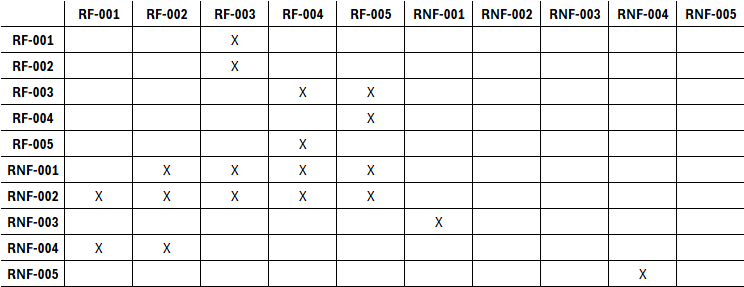
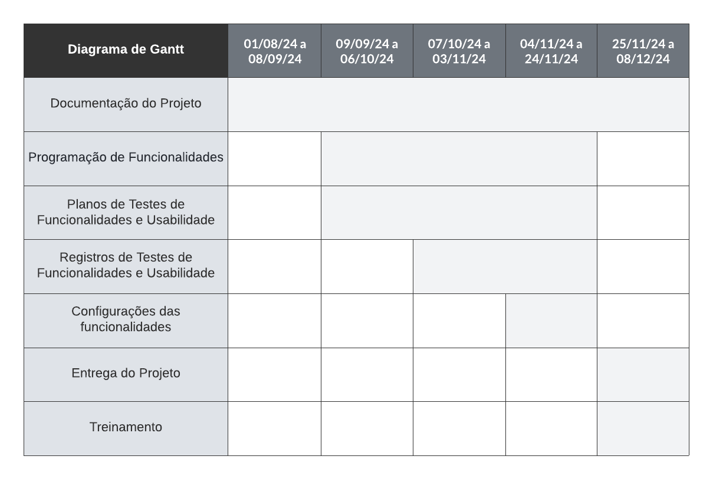
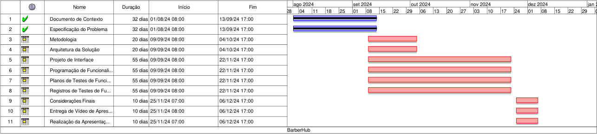
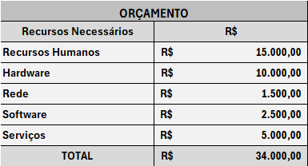

# Especificações do Projeto

Pré-requisitos: [Documentação de Contexto](https://github.com/ICEI-PUC-Minas-PMV-ADS/pmv-ads-2024-2-e3-proj-mov-t4-pmv-ads-2024-2-e3-proj-mov-t4-barberhub/blob/main/docs/01-Documenta%C3%A7%C3%A3o%20de%20Contexto.md).

Definição do problema e ideia de solução a partir da perspectiva do usuário. É composta pela definição do diagrama de personas, histórias de usuários, requisitos funcionais e não funcionais além das restrições do projeto.

Apresente uma visão geral do que será abordado nesta parte do documento, enumerando as técnicas e/ou ferramentas utilizadas para realizar a especificações do projeto

## Personas

- **João, o Executivo Moderno** (35 anos, Gerente de Marketing): Com uma agenda lotada, João valoriza a praticidade e agilidade no agendamento de serviços. Ele busca barbearias de qualidade e soluções rápidas para encaixar no seu dia corrido.
- **Maria, a Mãe Organizada** (40 anos, Professora): Combinando trabalho e cuidados com a família, Maria precisa de flexibilidade para agendar serviços para seus filhos e busca barbearias com ambiente familiar e horários ajustáveis.
- **Pedro, o Barbeiro Empreendedor** (28 anos, Barbeiro Autônomo): Autônomo e focado no crescimento de seu negócio, Pedro quer uma ferramenta que ajude a organizar sua agenda, evitar ociosidade e atrair novos clientes através de sua visibilidade online.

## Histórias de Usuários

Com base na análise das personas forma identificadas as seguintes histórias de usuários:

| EU COMO...`PERSONA`            | QUERO/PRECISO ...`FUNCIONALIDADE`                      | PARA ...`MOTIVO/VALOR`                                 |
| ------------------------------ | ------------------------------------------------------ | ------------------------------------------------------ |
| João, o Executivo Moderno      | Agendar cortes de cabelo e barba rapidamente           | Economizar tempo e garantir um horário disponível      |
| Maria, a Mãe Organizada        | Agendar horários para meus filhos de forma flexível    | Ajustar os compromissos ao cronograma familiar         |
| Pedro, o Barbeiro Empreendedor | Gerenciar minha agenda e horários disponíveis online   | Evitar ociosidade e atrair mais clientes               |
| João, o Executivo Moderno      | Receber notificações sobre promoções da barbearia      | Aproveitar descontos e novidades sem perder tempo      |
| Maria, a Mãe Organizada        | Ver o perfil e avaliações dos barbeiros                | Escolher o profissional mais adequado para meus filhos |
| Pedro, o Barbeiro Empreendedor | Promover meus serviços e divulgar meu portfólio no app | Atrair mais clientes e consolidar minha reputação      |

## Modelagem do Processo de Negócio

### Análise da Situação Atual

Atualmente, o agendamento de serviços em barbearias ocorre de forma manual, principalmente através de ligações telefônicas ou diretamente no estabelecimento. Este processo apresenta uma série de desafios:

1. **Dificuldade em agendar horários** : Os clientes enfrentam problemas para encontrar horários disponíveis devido à falta de uma agenda centralizada e atualizada.
2. **Comunicação ineficiente** : Barbearias dependem de atendentes para agendar e gerir os compromissos, o que pode gerar erros, como overbooking, cancelamentos ou falta de controle sobre os horários.
3. **Falta de informações sobre os barbeiros** : Não há transparência quanto ao portfólio, especializações e avaliações dos barbeiros, dificultando a escolha do profissional ideal para os clientes.
4. **Promoções mal divulgadas** : As promoções das barbearias muitas vezes não chegam a todos os clientes ou não são comunicadas de forma eficiente.
5. **Desperdício de tempo e recursos** : Barbearias enfrentam dificuldades para otimizar o uso do tempo e o gerenciamento de horários, o que pode resultar em períodos de ociosidade.

### Descrição Geral da Proposta

O Barber Hub propõe a criação de uma plataforma mobile que centralize e automatize o processo de agendamento de serviços em barbearias. Com o aplicativo, os clientes poderão agendar cortes e outros serviços diretamente pelo celular, de forma prática e rápida. Os principais limites e ligações com as estratégias e objetivos de negócios incluem:

1. **Automatização do agendamento** : O sistema permitirá que os clientes consultem horários disponíveis em tempo real, evitando conflitos de agenda e diminuindo a carga de trabalho dos atendentes.
2. **Perfil dos barbeiros** : Os clientes poderão visualizar informações detalhadas sobre os barbeiros, como portfólio, especialidades e avaliações de outros clientes, permitindo uma escolha mais informada.
3. **Promoções e ofertas** : O aplicativo possibilitará a divulgação de promoções e descontos, com notificações em tempo real para os clientes, aumentando a adesão a essas ofertas.
4. **Gestão eficiente para barbearias** : O Barber Hub permitirá uma melhor organização dos horários, evitando períodos de ociosidade e otimizando a capacidade de atendimento.
5. **Integração com pagamentos** : A proposta inclui a possibilidade de integração com sistemas de pagamento online, facilitando o fechamento da compra do serviço e oferecendo mais conveniência aos clientes.

O Barber Hub conecta diretamente a necessidade de praticidade e eficiência dos clientes com a oportunidade de otimizar processos de gestão para as barbearias. O sistema trará mais agilidade, controle e visibilidade para ambos os lados, oferecendo uma experiência completa e integrada

### Agendamento de Serviços de Barbearia

**Descrição** : Este processo descreve como os clientes utilizam o aplicativo Barber Hub para agendar serviços, desde a escolha do serviço até a confirmação do agendamento e recebimento do lembrete.

## Indicadores de Desempenho

| **Indicador**                  | **Definição**                                     | **Fórmula**                                             | **Meta**               |
| ------------------------------ | ------------------------------------------------- | ------------------------------------------------------- | ---------------------- |
| **Taxa de Ocupação**           | Percentual de horários ocupados.                  | (Horários agendados / Total de horários) \* 100         | ≥ 85% de ocupação      |
| **Taxa de Cancelamento**       | Percentual de agendamentos cancelados.            | (Cancelamentos / Total de agendamentos) \* 100          | ≤ 10% de cancelamentos |
| **Taxa de No-show**            | Percentual de faltas sem aviso prévio.            | (No-shows / Total de agendamentos) \* 100               | ≤ 5% de no-shows       |
| **Tempo Médio de Agendamento** | Tempo médio para concluir um agendamento.         | Soma dos tempos de agendamento / Número de agendamentos | < 2 minutos            |
| **Satisfação dos Clientes**    | Percentual de clientes satisfeitos com o serviço. | (Avaliações positivas / Total de avaliações) \* 100     | ≥ 90% de satisfação    |

Obs.: todas as informações para gerar os indicadores devem estar no diagrama de classe a ser apresentado a posteriori.

## Requisitos

As tabelas que se seguem apresentam os requisitos funcionais e não-funcionais que detalham o escopo do projeto. Para determinar a prioridade de requisitos, aplicar uma técnica de priorização de requisitos e detalhar como a técnica foi aplicada.

### Requisitos Funcionais

| ID     | Descrição do Requisito                                                                                                  | Prioridade |
| ------ | ----------------------------------------------------------------------------------------------------------------------- | ---------- |
| RF-001 | Permitir que os clientes se registrem com suas informações pessoais (tipo de usuário, nome, contato, e-mail e senha).   | ALTA       |
| RF-002 | Permitir que os barbeiros se registrem com informações de perfil profissional, como nome, experiência e especialidades. | ALTA       |
| RF-003 | Permitir a autenticação de clientes e barbeiros com login via e-mail/senha.                                             | ALTA       |
| RF-004 | Permitir que clientes agendem serviços como corte de cabelo, barba, entre outros, escolhendo data e hora disponíveis.   | MÉDIA      |
| RF-005 | Permitir que barbeiros visualizem, confirmem ou cancelem agendamentos.                                                  | MÉDIA      |
| RF-006 | Permitir que os usuários redefinam a senha.                                                                             | MÉDIA      |
| RF-007 | Permitir que os usuários visualizem as opções disponíveis na tela inicial.                                              | MÉDIA      |
| RF-008 | Permitir que os usuários marquem como favorito os barbeiros de interesse.                                               | MÉDIA      |
| RF-009 | Permitir que os usuários selecionem no mapa os barbeiros/barbearias de interesse.                                       | MÉDIA      |
| RF-010 | Permitir que os usuários façam logout no sistema.                                                                       | MÉDIA      |

### Requisitos Não-Funcionais

| ID      | Descrição do Requisito                                                                                                                              | Prioridade |
| ------- | --------------------------------------------------------------------------------------------------------------------------------------------------- | ---------- |
| RNF-001 | O sistema deve ser responsivo para rodar em um dispositivos móvel.                                                                                  | MÉDIA      |
| RNF-002 | Deve processar requisições do usuário em no máximo 3s.                                                                                              | BAIXA      |
| RNF-003 | O aplicativo deve ser fácil de usar, com uma interface intuitiva, acessível tanto para clientes quanto para barbeiros.                              | MÉDIA      |
| RNF-004 | O sistema deve ser capaz de lidar com um aumento no número de usuários (clientes e barbearias) sem comprometer o desempenho.                        | BAIXA      |
| RNF-005 | O sistema deve ser fácil de manter e atualizar, permitindo a adição de novos recursos e correções de bugs sem interrupção significativa no serviço. | ALTA       |

Esses requisitos buscam garantir que o Barber Hub atenda às necessidades de clientes e barbearias de forma eficiente e segura, ao mesmo tempo em que oferece uma experiência de usuário agradável e prática.

## Restrições

O projeto está restrito pelos itens apresentados na tabela a seguir.

| ID  | Restrição                                                                   |
| --- | --------------------------------------------------------------------------- |
| 01  | O projeto deverá ser entregue até o final do semestre                       |
| 02  | Não pode ser desenvolvido um módulo de backend                              |
| 03  | A equipe não pode subcontratar o desenvolvimento do trabalho                |
| 04  | Todos os membros do grupo devem ser responsáveis por cada parte do Trabalho |
| 05  | O sistema deve ser desenvolvido para plataforma Mobile                      |

## Diagrama de Casos de Uso

O diagrama de casos de uso é o próximo passo após a elicitação de requisitos, que utiliza um modelo gráfico e uma tabela com as descrições sucintas dos casos de uso e dos atores. Ele contempla a fronteira do sistema e o detalhamento dos requisitos funcionais com a indicação dos atores, casos de uso e seus relacionamentos.

O diagrama de casos de uso do Barber Hub destaca os principais atores (Cliente, Barbeiro e Admin/Barbearia) e seus respectivos casos de uso, como agendamento de serviços, consulta de disponibilidade, gerenciamento de agendamentos, entre outros. Cada ator tem seus relacionamentos com as funções do sistema, representados pelas setas.

# Matriz de Rastreabilidade

A matriz de rastreabilidade é uma ferramenta usada para facilitar a visualização dos relacionamento entre requisitos e outros artefatos ou objetos, permitindo a rastreabilidade entre os requisitos e os objetivos de negócio.

# Gerenciamento de Projeto

De acordo com o PMBoK v6 as dez áreas que constituem os pilares para gerenciar projetos, e que caracterizam a multidisciplinaridade envolvida, são: Integração, Escopo, Cronograma (Tempo), Custos, Qualidade, Recursos, Comunicações, Riscos, Aquisições, Partes Interessadas. Para desenvolver projetos um profissional deve se preocupar em gerenciar todas essas dez áreas. Elas se complementam e se relacionam, de tal forma que não se deve apenas examinar uma área de forma estanque. É preciso considerar, por exemplo, que as áreas de Escopo, Cronograma e Custos estão muito relacionadas. Assim, se eu amplio o escopo de um projeto eu posso afetar seu cronograma e seus custos.

## Gerenciamento de Tempo

O gráfico de Gantt ou diagrama de Gantt também é uma ferramenta visual utilizada para controlar e gerenciar o cronograma de atividades de um projeto. Com ele, é possível listar tudo que precisa ser feito para colocar o projeto em prática, dividir em atividades e estimar o tempo necessário para executá-las.

## Gerenciamento de Equipe

O gerenciamento adequado de tarefas contribuirá para que o projeto alcance altos níveis de produtividade. Por isso, é fundamental que ocorra a gestão de tarefas e de pessoas, de modo que os times envolvidos no projeto possam ser facilmente gerenciados.

## Gestão de Orçamento

O processo de determinar o orçamento do projeto é uma tarefa que depende, além dos produtos (saídas) dos processos anteriores do gerenciamento de custos, também de produtos oferecidos por outros processos de gerenciamento, como o escopo e o tempo.

