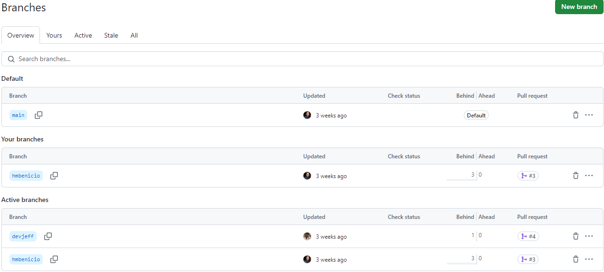
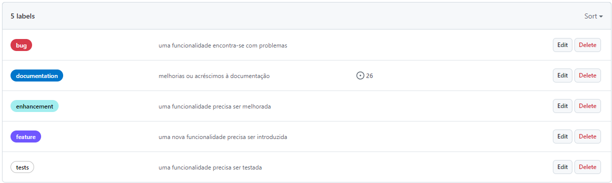
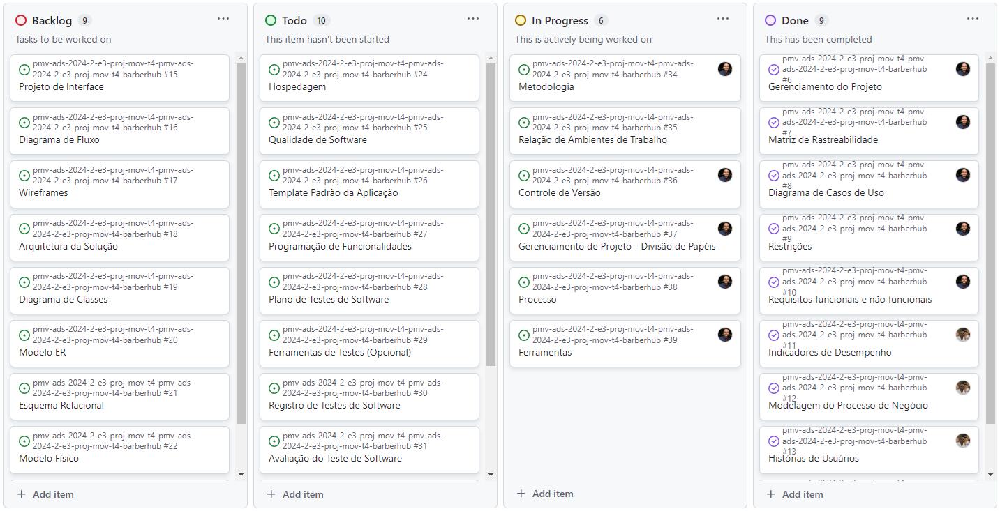

# Metodologia

Pré-requisitos: [Especificação do Projeto](https://github.com/ICEI-PUC-Minas-PMV-ADS/pmv-ads-2024-2-e3-proj-mov-t4-pmv-ads-2024-2-e3-proj-mov-t4-barberhub/blob/main/docs/02-Especifica%C3%A7%C3%A3o%20do%20Projeto.md).

O desenvolvimento deste projeto segue a metodologia ágil SCRUM, incluindo uma planning de 30 minutos às segundas e dois dias de daily de 15 minutos, às quartas e sextas. Essas reuniões são coordenadas pelo Scrum Master. Os ciclos semanais estão alinhados com a conclusão de cada sprint, que é representada como um milestone e possui suas respectivas tarefas registradas como issues no GitHub.

Além disso, a entrada de novas tarefas no backlog da equipe é principalmente guiada pelas demandas do Product Owner, sendo realizadas pelos membros da equipe responsáveis pelo desenvolvimento e design.

## Relação de Ambientes de Trabalho

Os artefatos do projeto são desenvolvidos a partir de diversas plataformas e a relação dos ambientes com seu respectivo propósito deverá ser apresentada em uma tabela que especifica que detalha Ambiente, Plataforma e Link de Acesso.

| **Ambiente**      | **Plataforma** | **Link de Acesso**                                         |
| ----------------- | -------------- | ---------------------------------------------------------- |
| Desenvolvimento   | Visual Code    | [Visual Studio](https://visualstudio.microsoft.com/pt-br/) |
| Ambiente de Teste | Expo Go        | [Expo Go](https://expo.dev/go)                             |
| Framework         | React Native   | [React Native](https://reactnative.dev/)                   |
| Banco de Dados    | Firebase       | [Firebase](https://firebase.google.com/?hl=pt-br)          |
| Comunicação       | Discord        | [Discord](https://discord.com/)                            |
| Wireframes        | Figma          | [Figma](https://www.figma.com/)                            |
| Stakeholders      | Canva          | [Canva](https://www.canva.com/)                            |
| Fluxogramas       | Heflo          | [Heflo](https://www.heflo.com/)                            |
| Diagramas         | Lucidchart     | [Lucid](https://lucid.app/)                                |

## Controle de Versão

A ferramenta de controle de versão adotada no projeto foi o
[Git](https://git-scm.com/), sendo que o [Github](https://github.com)
foi utilizado para hospedagem do repositório.

O projeto segue a seguinte convenção para o nome de branches:

- `main`: versão estável já testada do software
- `devjeff`: versão de desenvolvimento do software
- `hmbenicio`: versão de desenvolvimento do software

Quanto à gerência de issues, o projeto adota a seguinte convenção para
etiquetas:

- `bug`: uma funcionalidade encontra-se com problemas
- `documentation`: melhorias ou acréscimos à documentação
- `enhancement`: uma funcionalidade precisa ser melhorada
- `feature`: uma nova funcionalidade precisa ser introduzida
- `tests`: uma funcionalidade precisa ser testada

Discuta como a configuração do projeto foi feita na ferramenta de versionamento escolhida. Exponha como a gerência de tags, merges, commits e branchs é realizada. Discuta como a gerência de issues foi realizada.

## Gerenciamento de Projeto

A escolha da metodologia ágil SCRUM para este projeto é respaldada pelos benefícios citados por Amaral, Fleury e Isoni (2019, p. 68), que incluem:

- Visão clara dos resultados a entregar.
- Ritmo e disciplina necessários à execução.
- Definição de papéis e responsabilidades (Scrum Owner, Scrum Master e Team).
- Empoderamento dos membros da equipe.
- Conhecimento distribuído e compartilhado de forma colaborativa.
- Ambiente favorável para críticas construtivas.

### Divisão de Papéis

Apresente a divisão de papéis entre os membros do grupo.

Exemplificação: A equipe utiliza metodologias ágeis, tendo escolhido o Scrum como base para definição do processo de desenvolvimento. A equipe está organizada da seguinte maneira:

- Scrum Master: Helbert Miranda Benício;
- Product Owner: Jefferson Wagner S. Silva;
- Equipe de Desenvolvimento: Jefferson Wagner S. Silva,Helbert Miranda Benício;
- Equipe de Design: Jefferson Wagner S. Silva,Helbert Miranda Benício;

### Processo

Para organização e distribuição das tarefas do projeto, a equipe está utilizando o GitHub, estruturado com as seguintes listas:

- Backlog: recebe as tarefas a serem trabalhadas e representa o Backlog do produto. Todas as atividades identificadas no decorrer do projeto são incorporadas a esta lista;
- To Do: representa as tarefas retiradas do Backlog de trabalho iminente, isto é, tudo o que está para ser trabalhado em breve;
- In progress: contém as tarefas iniciadas;
- Done: inclui as tarefas finalizadas e as que passaram pelos testes e controle de qualidade, prontas para serem entregues aos usuários. O quadro kanban do grupo no GitHub está disponível no link https://github.com/orgs/ICEI-PUC-Minas-PMV-ADS/projects/1357/views/1?layout=board e é apresentado, no estado atual, na figura abaixo:

### Ferramentas

As ferramentas empregadas no projeto são:

- Gerenciamento de Tarefas: GitHub
- Editor de Código: Visual Code
- Ambiente de Teste: Expo Go
- Framework: React Native
- Banco de Dados: Firebase
- Ferramentas de Comunicação: Discord
- Mapa de Stakeholders: Canva
- Ferramentas de Desenho de Tela: Figma (wireframes)
- Ferramentas de Fluxograma: Heflo
- Ferramentas do Diagrama de Classes: lucidchart
- Ferramentas do Modelo Entidade Relacionamento: lucidchart
- Ferramentas do Projeto da Base de Dados: lucidchart

O editor de código foi escolhido porque ele possui uma integração com o sistema de versão. As ferramentas de comunicação utilizadas possuem integração semelhante e por isso foram selecionadas. Por fim, para criar diagramas utilizamos essa ferramenta por melhor captar as necessidades da nossa solução.
