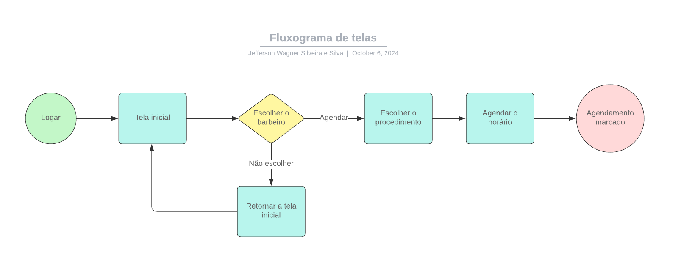
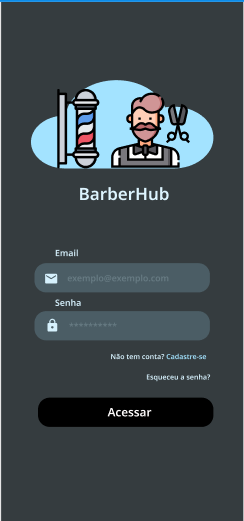
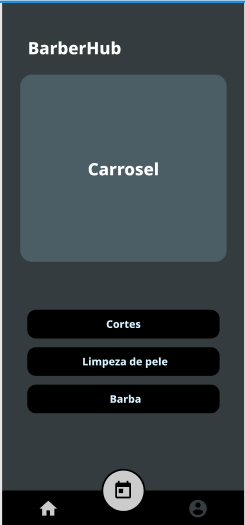
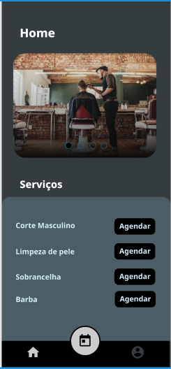
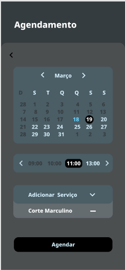
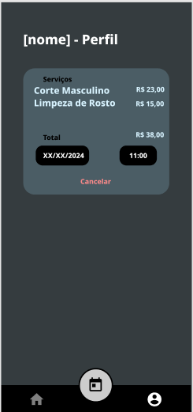

# Projeto de Interface

Pré-requisitos: [Especificação do Projeto](https://github.com/ICEI-PUC-Minas-PMV-ADS/pmv-ads-2024-2-e3-proj-mov-t4-pmv-ads-2024-2-e3-proj-mov-t4-barberhub/blob/main/docs/02-Especifica%C3%A7%C3%A3o%20do%20Projeto.md).

Visão geral da interação do usuário pelas telas do sistema e protótipo interativo das telas com as funcionalidades que fazem parte do sistema (wireframes).

Apresente as principais interfaces da plataforma. Discuta como ela foi elaborada de forma a atender os requisitos funcionais, não funcionais e histórias de usuário abordados nas [Especificação do Projeto](https://github.com/ICEI-PUC-Minas-PMV-ADS/pmv-ads-2024-2-e3-proj-mov-t4-pmv-ads-2024-2-e3-proj-mov-t4-barberhub/blob/main/docs/02-Especifica%C3%A7%C3%A3o%20do%20Projeto.md).

## Diagrama de Fluxo

## Wireframes

- Tela de Carregamento:

- Tela - Login:

- Tela - Cadastro:

\*

- Tela - Menu inicial:

- Tela - Menu intermediário:

- Tela - Menu de agendamentos:

- Tela - Agendamento confirmado:

