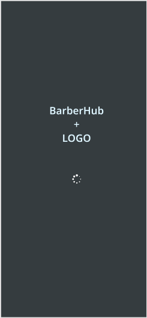
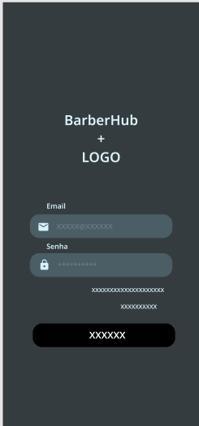
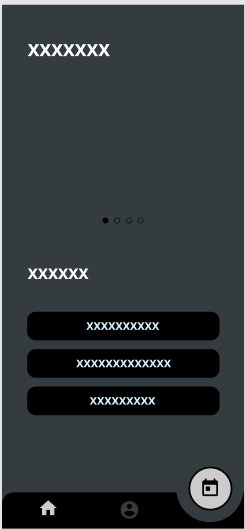

# Template Padrão da Aplicação

Pré-requisitos: [Especificação do Projeto](https://github.com/ICEI-PUC-Minas-PMV-ADS/pmv-ads-2024-2-e3-proj-mov-t4-pmv-ads-2024-2-e3-proj-mov-t4-barberhub/blob/main/docs/02-Especifica%C3%A7%C3%A3o%20do%20Projeto.md), [Projeto de Interface](https://github.com/ICEI-PUC-Minas-PMV-ADS/pmv-ads-2024-2-e3-proj-mov-t4-pmv-ads-2024-2-e3-proj-mov-t4-barberhub/blob/main/docs/04-Projeto%20de%20Interface.md), [Metodologia](https://github.com/ICEI-PUC-Minas-PMV-ADS/pmv-ads-2024-2-e3-proj-mov-t4-pmv-ads-2024-2-e3-proj-mov-t4-barberhub/blob/main/docs/03-Metodologia.md).

1. Template de Carregamento:

2. Template padrão de Login:

3. Template base de tela comum:

A identidade visual será desenvolvida com base em um design minimalista, leve e dinâmico, utilizando a paleta de cores demonstrada a seguir, representadas pelos códigos:

#F9BA32, #426E86, #F8F1E5, #2F3131, #F0810F

