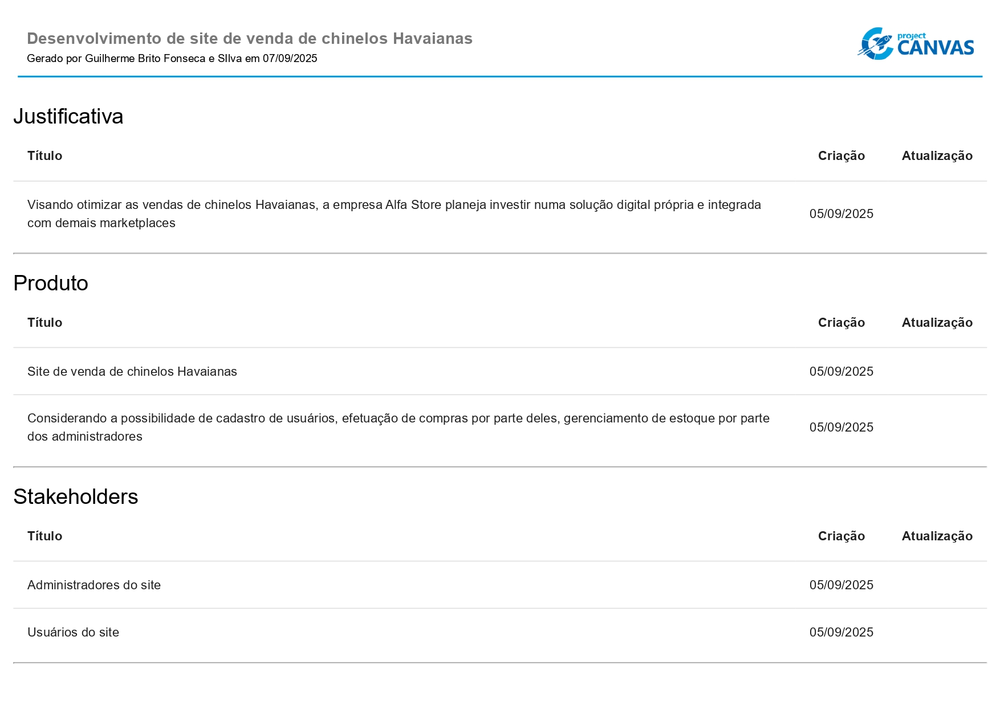
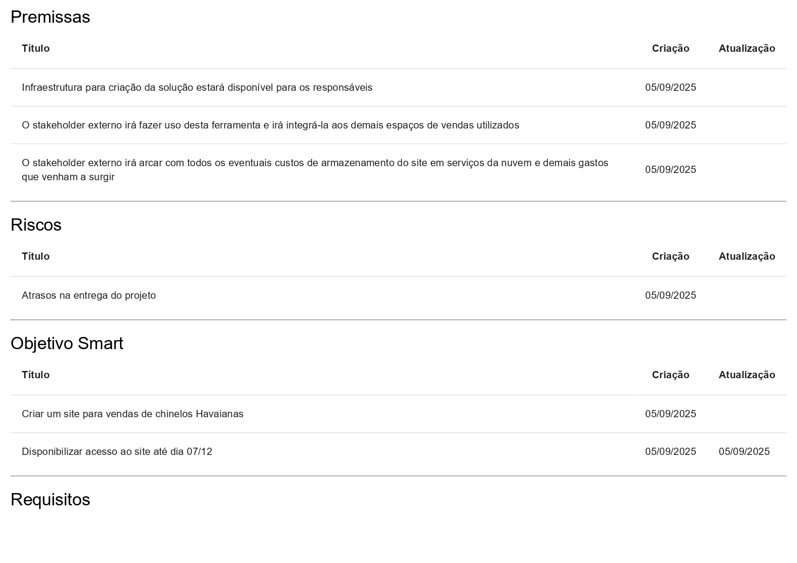
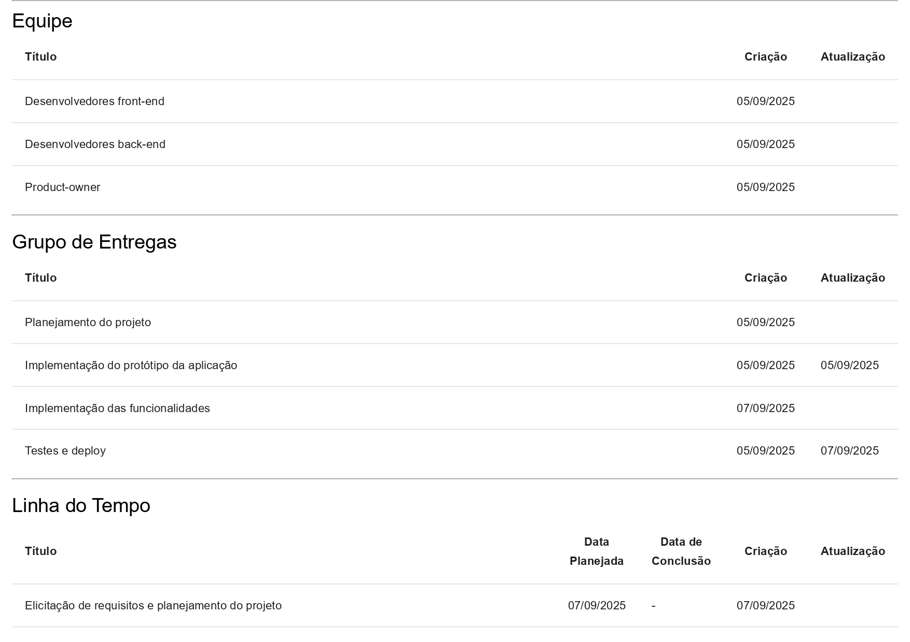
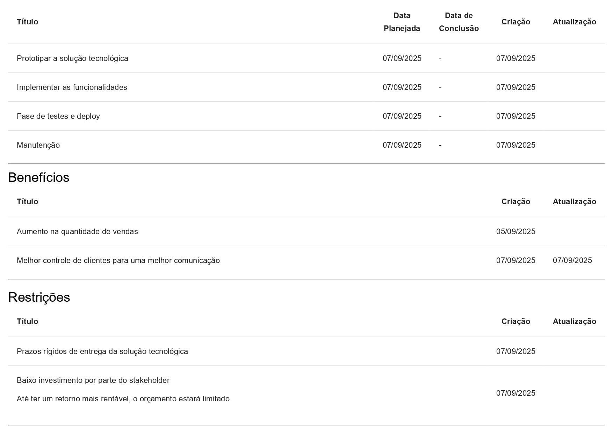
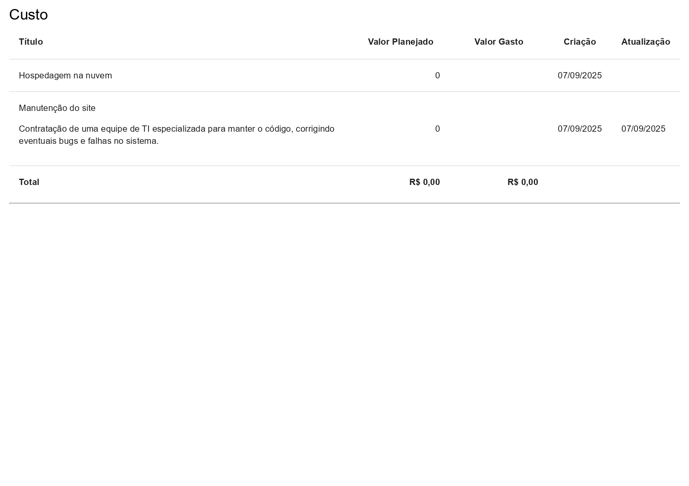
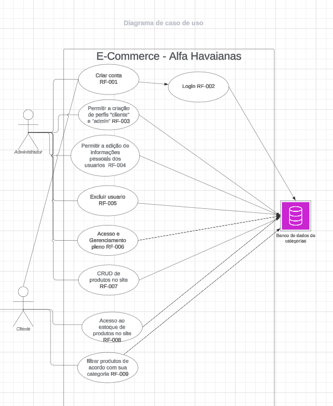

# Etapa 1 - Apresentação da proposta da solução

- Arquivo de apresentação (em slides) da proposta de solução: [Apresentação da proposta de solução - Ecommerce_Alfa_Havaianas.pdf](<./Apresentação da proposta de solução - Ecommerce_Alfa_Havaianas.pdf>)

##### Descrição do cliente:

A AlfaStore é uma loja parceira da Havaianas focada em comercializar sandálias e acessórios oficiais por meio de um e-commerce simples, rápido e seguro. O cliente busca ampliar o alcance digital, oferecer navegação intuitiva em desktop e mobile, viabilizar pagamentos online confiáveis e otimizar o acompanhamento de pedidos para melhorar a experiência do consumidor final.

##### Project Model Canvas:

##### Diagrama de Caso de Uso:

# Etapa 5 - Apresentação da Solução

- ##### _Apresentação para Mostra de Extensão Eixo 5 ADS_:

- Arquivo de apresentação (em slides) solução: [Apresentação da solução - Ecommerce_Alfa_Havaianas.pdf](<./Apresentação da Solução - Ecommerce_Alfa_Havaianas.pdf>)

  - **Descrição do cliente**: AlfaStore é uma loja parceira da Havaianas que comercializa sandálias e acessórios oficiais e buscou digitalizar o catálogo para ampliar alcance e agilizar o atendimento em desktop e mobile.

  - **Objetivo da aplicação**: entregar um e-commerce simples, rápido e seguro, com vitrine filtrável, carrinho funcional, checkout via Mercado Pago e área de perfil para acompanhamento de dados.

  - **Telas principais**: Home com banners, busca e filtros; listagem/detalhe de produtos; carrinho e resumo para checkout; perfil do usuário; painel de estoque para o administrador cadastrar, editar e paginar produtos.

  - **Pontos positivos e desafios da experiência extensionista**: proximidade com o cliente, usabilidade mobile/desktop e integração real de pagamento; desafios em granularidade de tamanhos/estampas, conciliação de promoções e homologação com o gateway.

  - **Conclusão da equipe**: a solução moderniza o processo comercial da AlfaStore e deixa base pronta para produção, com caminho aberto para evoluções de UX, marketing e observabilidade.

- ##### _Vídeo de apresentação da solução:_

  https://github.com/user-attachments/assets/644b394a-1dc4-4bc3-b84a-052674300cde

  - Tamanho do arquivo limitado a 90Mb;
  - Taxa de FPS limitada a 30 quadros por segundo;
  - Resolução HD (720p) ou Full HD (1080p);
  - Formato mp4.
