# Projeto de Interface

Pré-requisitos: <a href="02-Especificação do Projeto.md"> Especificação do Projeto</a>

Visão geral da interação do usuário com as funcionalidades que fazem parte do sistema sociotécnico (protótipo de telas).

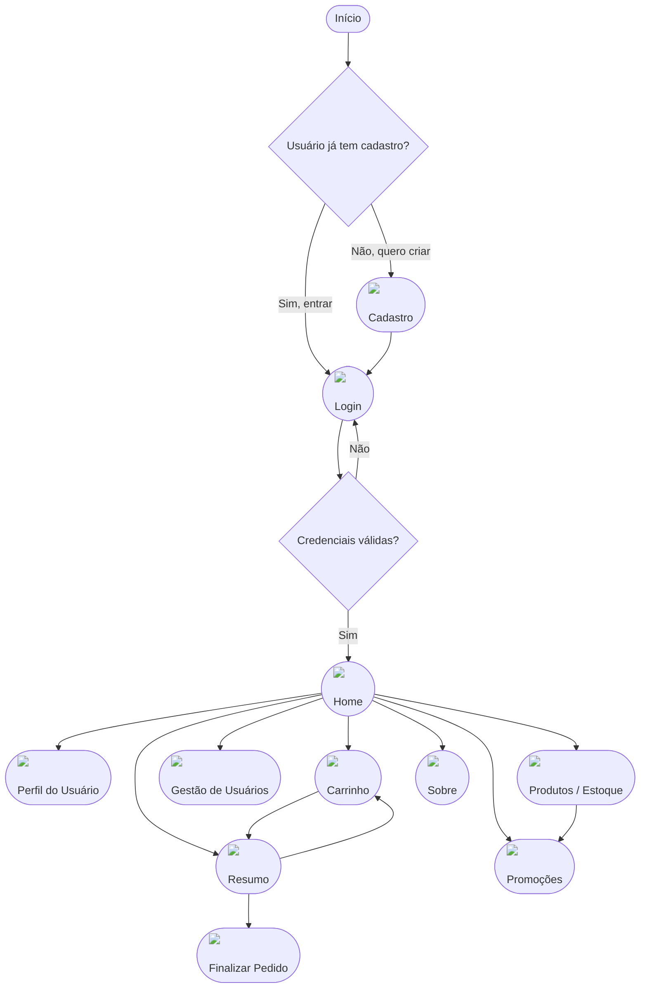

## Protótipo de Telas

### Login

- Tela de autenticação que permite o acesso de clientes e administradores à plataforma.
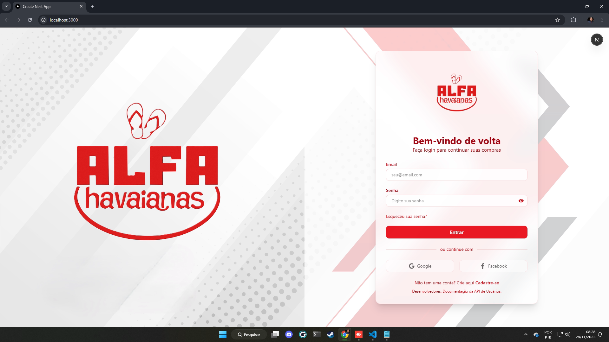

### Cadastro de Usuário

- Formulário para criação de conta, coletando dados pessoais e credenciais de acesso.
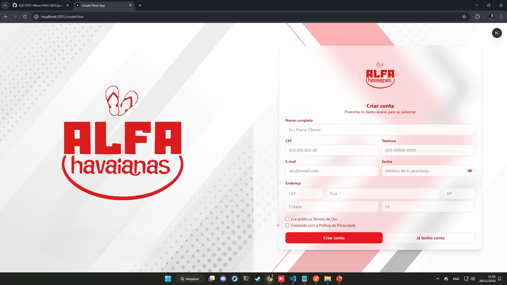

### Home

- Vitrine inicial com destaques de produtos e navegação para categorias e ofertas.
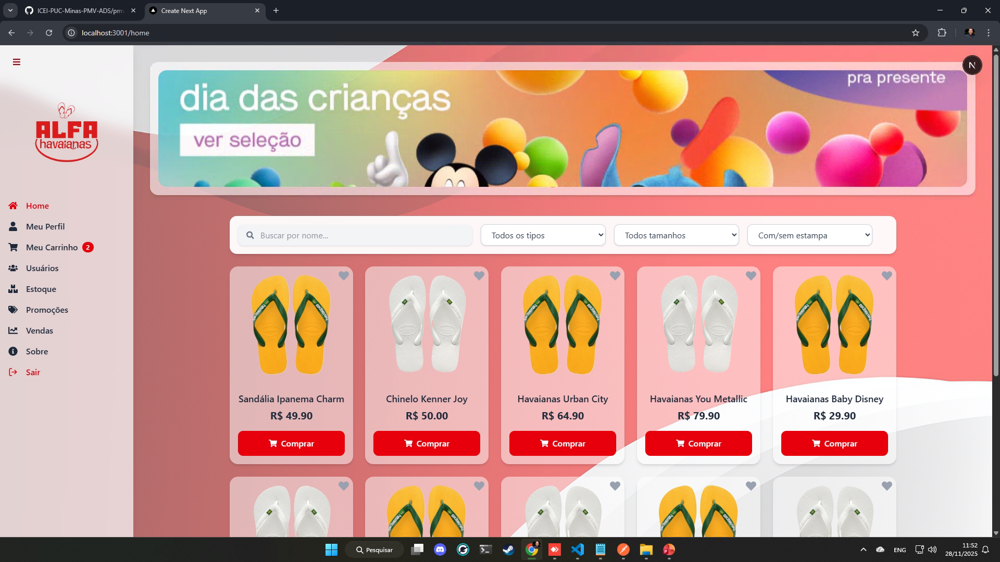

### Perfil do Usuário

- Painel para consulta e edição de informações pessoais, endereço e dados de contato.
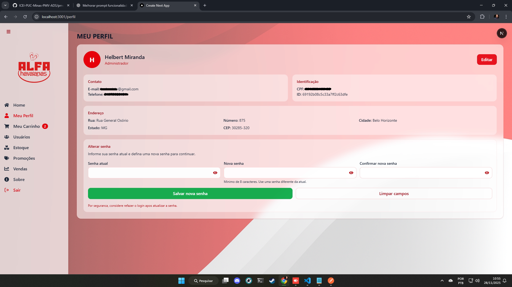

### Carrinho de Compras

- Listagem dos itens selecionados, permitindo ajustar quantidades ou remover produtos.
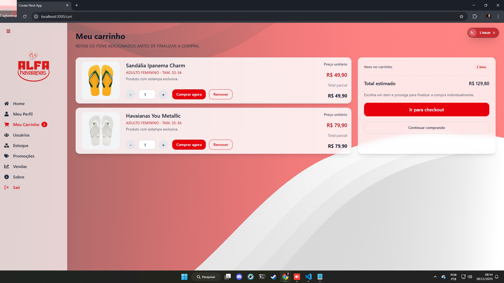

### Resumo da Compra

- Etapa de confirmação do pedido com totais, endereço e forma de pagamento.
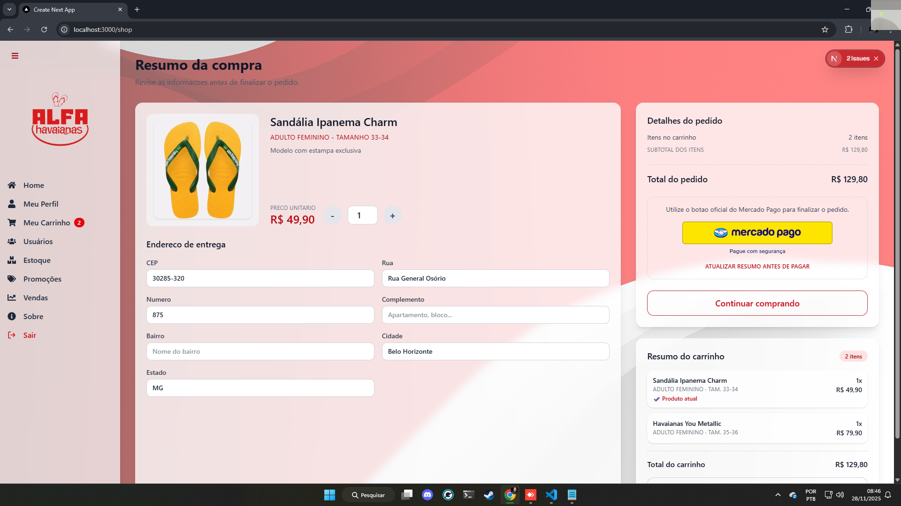

### Gestão de Usuários

- Visão administrativa para listar, pesquisar e gerenciar perfis cadastrados.
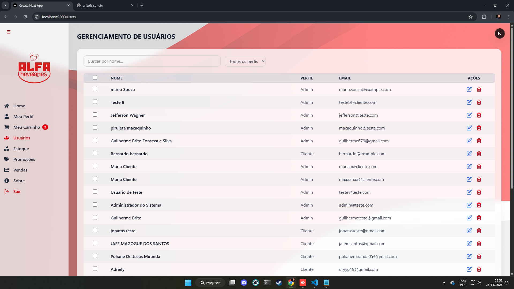

### Cadastro e Estoque de Produtos

- Interface para inserção, edição e controle de itens do catálogo, incluindo estoque.
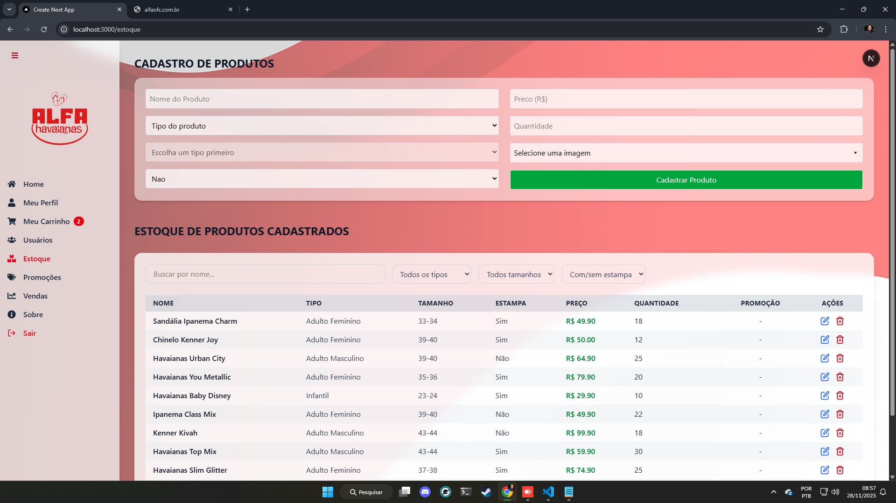

### Cadastro de Promoções

- Tela para configurar descontos e campanhas aplicadas aos produtos.
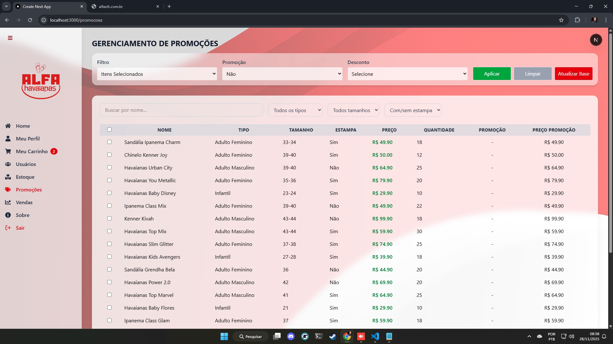

### Vendas

- Painel de acompanhamento de pedidos realizados e status de entrega.
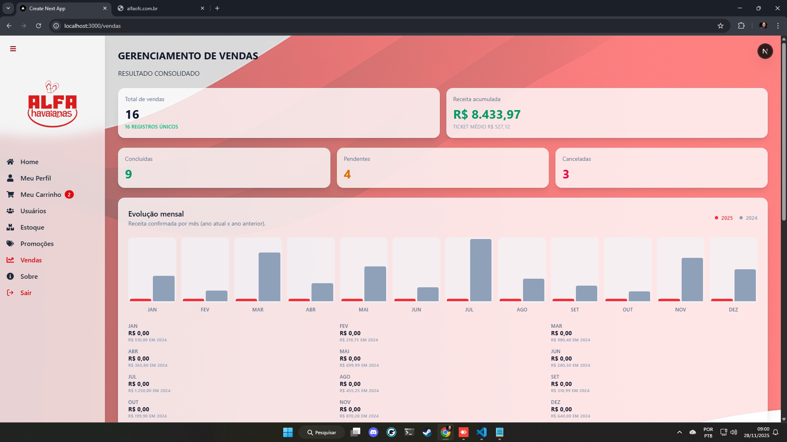

### Sobre

- Página institucional apresentando informações da AlfaStore e sua proposta de valor.
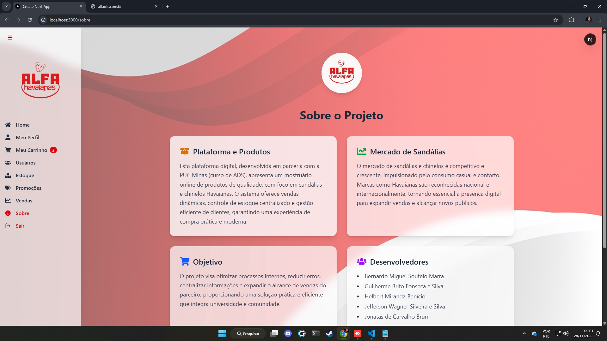
